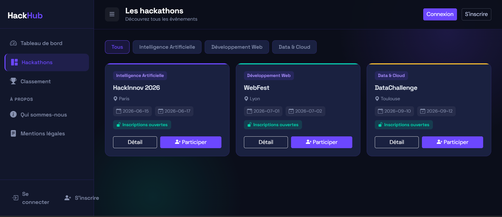
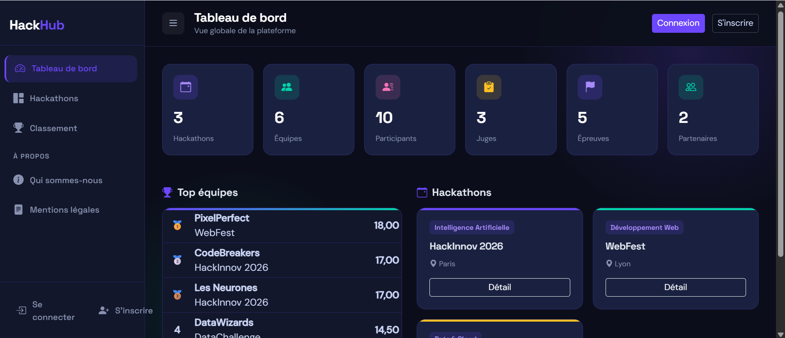
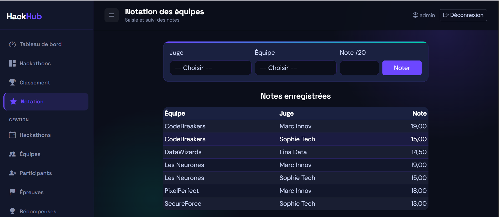

# HackHub — Plateforme de gestion de hackathons

Application web de gestion de hackathons : un organisateur crée des événements et des épreuves, les participants s'inscrivent et forment des équipes (via un code d'équipe), les juges notent les projets, et un classement est généré automatiquement.

Projet réalisé dans le cadre d'un module de développement d'application (travail d'équipe). **Ma contribution : le backend** — modèle de données Java, logique métier, sécurité et validation.

## Aperçu






## Stack technique

- **Java 21**, **Spring Boot 4**
- **Spring Data JDBC** + **PostgreSQL**
- **Spring Security** — authentification par formulaire, hachage **BCrypt**, « remember-me », sécurité par rôle
- **Thymeleaf** + **Bootstrap 5.3** (thème sombre, responsive)
- **Bean Validation** (jakarta.validation)
- **Lombok**, **Gradle** (Kotlin DSL)

## Fonctionnalités

- **Inscription par profil** : Participant, Juge, Organisateur, Partenaire, Mentor. Le rôle est déduit du lien entre le compte et l'entité métier.
- **Gestion d'équipe** : créer une équipe (génération d'un code unique) ou rejoindre une équipe existante via son code.
- **CRUD complet** sur les entités : hackathons, équipes, participants, épreuves, récompenses, juges, mentors, organisateurs, partenaires, membres du staff, comptes.
- **Notation** des équipes par les juges (insertion / mise à jour de note).
- **Classement** automatique des équipes par moyenne.
- **Tableau de bord** avec statistiques et top équipes.
- Pages de **détail** (hackathon, équipe) et **filtres par catégorie**.
- **Sécurité par rôle** (ADMIN, ORGANISATEUR, JUGE, PARTICIPANT, PARTENAIRE, MENTOR).
- **Validation des formulaires** côté serveur (champs obligatoires, formats, longueurs) avec messages d'erreur.

## Architecture (backend)

```
src/main/java/hackathon/
├── domain/        # entités (mapping Spring Data JDBC + Bean Validation)
├── repository/    # accès aux données (Spring Data + DAO pour les tables d'association)
├── service/       # logique métier
├── controller/    # contrôleurs MVC (rendu Thymeleaf)
├── security/      # configuration Spring Security
└── util/          # utilitaires (pagination, alertes)
src/main/resources/
├── templates/     # vues Thymeleaf
├── static/        # CSS / JS / images
└── db/sql/        # scripts SQL (schéma, procédures, données de test)
```

## Lancer le projet en local

### Prérequis

- Java 21
- PostgreSQL
- Le wrapper Gradle est inclus (`./gradlew`)

### 1. Créer la base de données

```sql
CREATE DATABASE hackathon;
```

### 2. Configurer l'accès

Copier le fichier d'exemple puis adapter les identifiants :

```bash
cp src/main/resources/application.properties.example src/main/resources/application.properties
```

### 3. Charger le schéma et les données de démo

Le schéma, les procédures et les données de test sont chargés via le test `Init_DB` :

- depuis l'IDE : exécuter `src/test/java/hackathon/db/Init_DB.java` en test JUnit,
- ou exécuter manuellement, dans l'ordre, les scripts de `src/main/resources/db/sql/` : `1-tables.sql`, `2-procedures.sql`, `3-data.sql`.

### 4. Démarrer l'application

```bash
./gradlew bootRun
```

Application accessible sur **http://localhost:8089**.

## Comptes de démonstration

Mot de passe commun : **`HackHub@2026`** (connexion possible par identifiant ou e-mail).

| Rôle         | Identifiants                |
| ------------ | --------------------------- |
| Admin        | `admin`                     |
| Organisateur | `marie`, `paul`             |
| Juge         | `sophie`, `marc`, `lina`    |
| Participant  | `max`, `mika`, `tom`, `eva` |
| Partenaire   | `techcorp`, `datasoft`      |
| Mentor       | `alex`, `nina`              |

## Auteur

Backend développé par **Cyril Tuekam** — modèle de données, repositories, services, contrôleurs, Spring Security multi-rôles, validation et logique métier (inscription, équipes, notation, classement).

- GitHub : [https://github.com/Cyrolymp](https://github.com/Cyrolymp)
- LinkedIn : [https://www.linkedin.com/in/tuekam-8a5584205](https://www.linkedin.com/in/cyril-tuekam-8a5584205)

> Projet d'équipe : la base de données et le front-end ont été pris en charge par d'autres membres du groupe.

## Licence

Ce projet est distribué sous licence **MIT** — voir le fichier [LICENSE](LICENSE).
